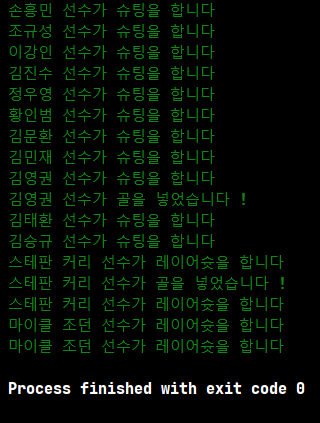

# 리플렉션

구글에 자바 리플렉션이라고 검색하면 흔히 다음과 같은 정의를 볼 수 있다

**구체적인 클래스 타입을 알지 못해도 그 클래스의 메소드, 타입, 변수들에 접근할 수 있도록 해주는 자바 API**

위키피디아의 정의는 다음과 같다

“**컴퓨터 과학에서 리플렉티브 프로그래밍 또는 리플렉션이란 자기 구조나 행동을 검사, 성찰하고 수정할 수 있는 프로세스의 능력이다**”

자기 구조나 행동을 검사, 성찰, 수정한다는 것은 무슨 말일까? 

일반적으로 자바 프로그래밍을 할 때 객체를 생성한다면 다음과 같다

```java
Temp temp = new Temp();
```

객체 타입의 참조변수를 선언하고 생성자를 호출해서 인스턴스화한다

허나 리플렉션을 사용한다면 컴파일 시점이 아닌 런타임에 위와 같은 Temp 객체를 동적으로 인스턴스화할 수 있다

객체는 자기 상태를 나타내는 필드와 역할을 수행하는 메서드로 구성된다

위와 같이 런타임에 인스턴스화하는 것처럼 객체의 상태와 메서드를 조회할 수 있고 값을 변경시킬 수 있다

또한 메서드를 호출할 수도 있다

이러한 리플렉션은 프레임워크에서 자주 사용되는데 대표적인 예시가 스프링이다 

스프링 컨테이너에 스프링 빈을 등록할 때 생성자를 호출하는 대신 @Component와 같은 어노테이션할 수 있는 것은 스프링이 리플렉션을 사용하여 스프링 빈을 등록할 대상을 구분하기 때문이다

참고로 리플렉션은 metadata인 어노테이션도 볼 수 있다

## 코드 예시

코드의 구조는 다음과 같다


Player 타입의 두 가지의 구현체인, 축구선수와 농구선수 객체가 있다

각 Player들은 Skill 인터페이스를 의존하고 있으며 이를 주입받는다

Player 객체들은 Skill의 메서드를 호출하여 경기에 임한다

Skill 인터페이스의 구현체는 선수들이 사용할 기술들이다

아래의 코드는 축구 선수 출전 명단을 뽑는 코드이다

축구팀의 전체 선수(soccerMembers) 중 일부분이 출전한다

```java
try {
	    for (int i = 0; i < 11; i++) {
	        Field status = soccerMembers[i].getClass().getDeclaredField("status");
	        status.setAccessible(true);
	        status.set(soccerMembers[i], true);
	
	        soccerPlayers[i] = new SoccerPlayer(soccerMembers[i].getName());
	    }
	} catch (NoSuchFieldException | IllegalAccessException e) {
	    e.printStackTrace();
}
```

(간단하게 앞의 11명 선수만 출전시킨다)

getClass().getDeclaredField() 메서드로 각 선수들의 필드값을 조회하고 true로 변경한다

리플렉션은 접근 제어자와 상관없이 값을 변경시킬 수 있다

위의 코드는 값을 조회해서 변경시키는 단순한 예제였다

아래의 예제는 어노테이션을 활용하여 객체를 주입하는 예제이다

```java
public class SoccerPlayer extends Player{

    @Learn("SoccerSkill")
    private Skill skill;

    int goal;
    private boolean status;

    public SoccerPlayer(String name){
        super(name);
        this.goal = 0;
        this.status = false;
    }

    @Override
    public void play() {
        int shootingAccuracy = skill.shot(name);
        if (shootingAccuracy == 5) {
            skill.goal(name);
        }
    }

    public boolean isStatus() {
        return status;
    }

}
```

SoccerPlayer 객체는 Skill 인터페이스의 메서드를 호출해 경기에 임한다 (play())

주입받을 참조변수에 @Learn 어노테이션을 적용한다

Skill 객체가 주입받는 시점은 부모 생성자를 호출할 때이다  (Player(name))

```java
public class Player {
    protected String name;

    private Player() {
    }

    public Player(String name){
        this.name = name;

        try {
            for (Field field : this.getClass().getDeclaredFields()) {
                Learn learn = field.getDeclaredAnnotation(Learn.class);

                if (learn != null) {
                    field.setAccessible(true);
                    String learnTypeName = learn.value();

                    Class<?> DIType = Class.forName("reflection.member." + learnTypeName);

                    Constructor<?> constructor = DIType.getConstructor();
                    field.set(this, constructor.newInstance());
                }
            }
        } catch (InstantiationException | IllegalAccessException | InvocationTargetException e) {
            e.printStackTrace();
        } catch (NoSuchMethodException e) {
            throw new RuntimeException(e);
        } catch (ClassNotFoundException e) {
            throw new RuntimeException(e);
        }

    }

    public void play() {

    }

    public String getName() {
        return name;
    }
}
```

Player(String name)을 누가 호출했는지 분간하기 위해 this 키워드를 사용한다

해당 객체의 필드에 Learn 타입의 어노테이션이 적용된 필드가 있는지 확인한다

만약 있다면 어노테이션의 값에 따라 클래스 정보를 얻는다 (learn.value() → Class.forName())

얻은 클래스 정보를 토대로 생성자를 얻고 Learn 타입의 어노테이션이 적용된 필드에 생성자를 주입한다

## 실행 결과



## 아쉬운 점

위의 Player(String name) 코드에서 클래스 정보를 얻으려고 할 때 Class.forName("reflection.member." + learnTypeName) 형태로 직접 패키지 구조까지 명시한다

패키지 구조까지 찾아서 클래스 정보를 얻는다면 더 유연한 코드가 될 듯 하다

기회가 된다면 스프링 프레임워크 코드를 분석해서 DI, Autowired 내부 동작이 어떻게 되는지 알아야 겠다
